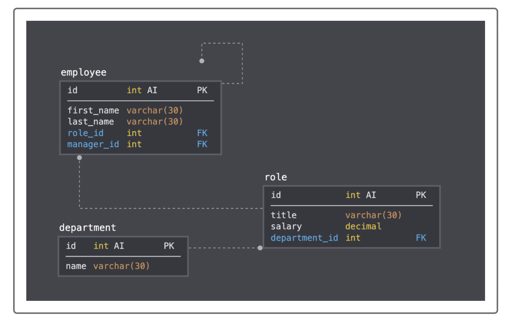

  
# Employee Tracker

## License
Open Database License (ODbL)

## Description: 
Create an interfaces that makes it easy for non-developers to view and interact with information stored in databases.  Use a command-line application to manage a company's employee database using Node.js, Inquirer and MySQL.

### Contents
1.  [Installation](#installation)
2.  [Usage](#usage)
3.  [Contributing](#contributing)
4.  [Tests](#tests)

## Installation:  
npm, Node.js, Inquirer and MySQL will need to be installed to run the project.

## Usage:
The project will use the workforce database.  The database will consist of 4 tables: employees, roles, departments and managers.

#EmployeeTracker

## Contributing:
None

## Tests:
To run this project, type "node index.js" or "node index" at the command prompt (quotation marks are not required)

## Questions:
Github profile:[TCYang1006](https://github.com/TCYang1006)
If there are any additional questions about this project, please contact me at [yangtongchee@hotmail.com](yangtongchee@hotmail.com)